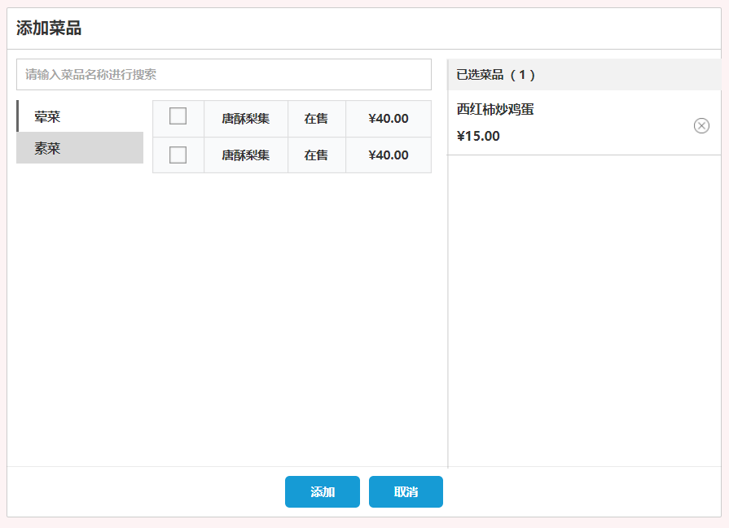

### 需求分析与设计

产品原型：




业务规则：

- 套餐名称唯一
- 套餐必须属于某个分类
- 套餐必须包含菜品
- 名称、分类、价格、图片为必填项
- 添加菜品窗口需要根据分类类型来展示菜品
- 新增的套餐默认为停售状态

接口设计（共涉及到4个接口）：

- 根据类型查询分类（已完成）
- 根据分类id查询菜品
- 图片上传（已完成）
- 新增套餐


### 代码开发

#### 根据分类id查询菜品

##### 错误点：

- 这个path是/list，传的categoryId是作为Query提交的，不能作为路径！所以也不能用@PathVariable！
- 传给mapper要**传dish**查询对象，因为要**查可售状态**的菜品，也可以根据菜品名称搜索！
- 要查可售状态的菜品就要设置status为1
- 查询SQL直接写`<where>`了，忘写`select * from dish`

代码见[[6、项目实战-套餐管理 - 参考答案#1.2.1 DishController]]

易错代码，DishServiceImpl：

```java
@Override  
public List<Dish> getDishes(Long categoryId) {  
    //传给mapper要传dish查询对象，因为要查可售状态的菜品，也可以根据菜品名称搜索  
    Dish dish = new Dish();  
    dish.setCategoryId(categoryId);  
    //要查可售状态的菜品  
    dish.setStatus(StatusConstant.ENABLE);  
    List<Dish> list = dishMapper.getDishes(dish);  
    return list;  
}
```


测试成功：

![[Pasted image 20240516211524.png]]

#### 新增套餐

##### 错误点：

- 逻辑没有理清楚，前端传的是SetmealDTO对象，里面有菜品-套餐关联信息，后端首先要提取SetmealDTO中的Setmeal对象新增到套餐表；
- 然后提取刚刚新增的套餐表的主键ID，再提取SetmealDTO中的菜品-套餐关联信息；
- 然后将这两部分封装成SetmealDish对象新增到菜品-套餐关联表！

完整代码见[[6、项目实战-套餐管理 - 参考答案#1.2.6 SetmealController]]

易错代码，SetmealServiceImpl：

```java
@Override  
public void insertWithDish(SetmealDTO setmealDTO) {  
    Setmeal setmeal = new Setmeal();  
    BeanUtils.copyProperties(setmealDTO, setmeal);  
    setmealMapper.insert(setmeal);  
  
    //获取生成的套餐id  
    Long setmealId = setmeal.getId();  
    //前端DTO里也传了套餐-菜品关联的集合，遍历集合把刚刚创建的套餐ID加入到对应关系表中  
    List<SetmealDish> setmealDishes = setmealDTO.getSetmealDishes();  
    if (setmealDishes != null && !setmealDishes.isEmpty()) {  
        setmealDishes.forEach(setmealDish -> {  
            setmealDish.setSetmealId(setmealId); //将套餐Id赋给setmealDish的每个对象  
        });  
    }  
    //批量插入套餐-菜品关联数据  
    setmealDishMapper.insertBatch(setmealDishes);  
}
```

SetmealMapper：

```xml
<insert id="insert" parameterType="Setmeal" useGeneratedKeys="true" keyProperty="id">  
    insert into setmeal  
    (category_id, name, price, status, description, image, create_time, update_time, create_user, update_user)    values (#{categoryId}, #{name}, #{price}, #{status}, #{description}, #{image}, #{createTime}, #{updateTime}, #{createUser}, #{updateUser})
</insert>
```

测试：

![[Pasted image 20240516235358.png]]

![[Pasted image 20240516235456.png|425]]

![[Pasted image 20240516235740.png]]

![[Pasted image 20240516235729.png]]

