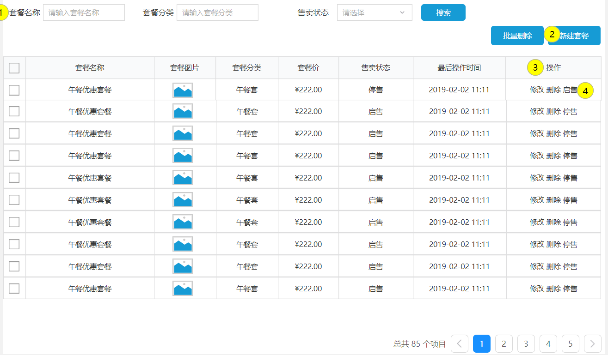

### 需求分析和设计

产品原型：



业务规则：

- 根据页码进行分页展示
- 每页展示10条数据
- 可以根据需要，按照套餐名称、分类、售卖状态进行查询

接口设计：


### 代码开发

##### 错误点：

- 返回值有套餐名称，这个在套餐表里没有，在分类表里才有，所以要级联查询：

![[Pasted image 20240517094216.png]]

![[Pasted image 20240517094158.png]]

```xml
<select id="pageQuery" resultType="com.sky.vo.SetmealVO">  
    select s.*, c.name as categoryName from setmeal s left outer join category c on s.category_id = c.id  
    <where>  
        <if test="name != null and name != '' ">  
            and s.name like concat('%',#{name},'%')  
        </if>  
        <if test="categoryId != null">  
            and s.category_id = #{categoryId}  
        </if>  
        <if test="status != null">  
            and s.status = #{status}  
        </if>  
    </where>
```

- 返回给前端的应该是`list<SetmealVO>`对象，包括了套餐分类；后端传过来的是SetmealDTO对象，不要搞混了！

SetmealServiceImpl：

```java
@Override  
public PageResult pageQuery(SetmealPageQueryDTO setmealPageQueryDTO) {  
    //分页查询  
    PageHelper.startPage(setmealPageQueryDTO.getPage(), setmealPageQueryDTO.getPageSize());  
    //根据条件查询  
    Page<SetmealVO> page = setmealMapper.pageQuery(setmealPageQueryDTO);  
    return new PageResult(page.getTotal(), page.getResult());  
}
```

- 分页查询是PageHelper帮我们做的，条件查询一定要写，但里面不用写具体分页查询操作了！

### 测试

成功显示，包括套餐分类。

![[Pasted image 20240517094457.png]]