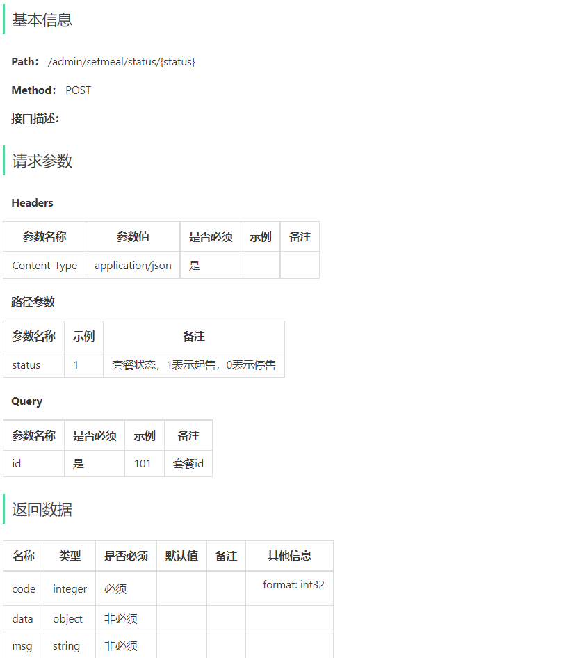

### 需求分析和设计

产品原型：

业务规则：

- 可以对状态为起售的套餐进行停售操作，可以对状态为停售的套餐进行起售操作
- 起售的套餐可以展示在用户端，停售的套餐不能展示在用户端
- 起售套餐时，如果套餐内包含停售的菜品，则不能起售

接口设计：

### 代码开发

##### 错误点：

- 传递的是两个参数，controller写法要熟悉；
- 要查询对应菜品是否有停售的，有的话不能起售；
- SQL查询要熟悉！

#####  SetmealController

~~~java
/**
     * 套餐起售停售
     * @param status
     * @param id
     * @return
*/
@PostMapping("/status/{status}")
@ApiOperation("套餐起售停售")
public Result startOrStop(@PathVariable Integer status, Long id) {
    setmealService.startOrStop(status, id);
    return Result.success();
}
~~~

#####  SetmealService

~~~java
/**
     * 套餐起售、停售
     * @param status
     * @param id
*/
void startOrStop(Integer status, Long id);
~~~

#####  SetmealServiceImpl

~~~java
/**
     * 套餐起售、停售
     * @param status
     * @param id
*/
public void startOrStop(Integer status, Long id) {
    //起售套餐时，判断套餐内是否有停售菜品，有停售菜品提示"套餐内包含未启售菜品，无法启售"
    if(status == StatusConstant.ENABLE){
        //select a.* from dish a left join setmeal_dish b on a.id = b.dish_id where b.setmeal_id = ?
        List<Dish> dishList = dishMapper.getBySetmealId(id);
        if(dishes != null && !dishes.isEmpty()){  
            for (Dish dish : dishes) {  
                if(Objects.equals(dish.getStatus(), StatusConstant.DISABLE)){  
                    throw new DeletionNotAllowedException(MessageConstant.SETMEAL_ENABLE_FAILED);  
        }  
    }  
}
    //如果满足条件 更改状态
    Setmeal setmeal = Setmeal.builder()
        .id(id)
        .status(status)
        .build();
    setmealMapper.update(setmeal);
}
~~~

##### DishMapper

~~~java
/**
     * 根据套餐id查询菜品
     * @param setmealId
     * @return
*/
@Select("select a.* from dish a left join setmeal_dish b on a.id = b.dish_id where b.setmeal_id = #{setmealId}")
List<Dish> getBySetmealId(Long setmealId);
~~~

### 测试

测试没问题，但菜品的起售停售状态还没写，有空加上。

![[Pasted image 20240517130400.png]]